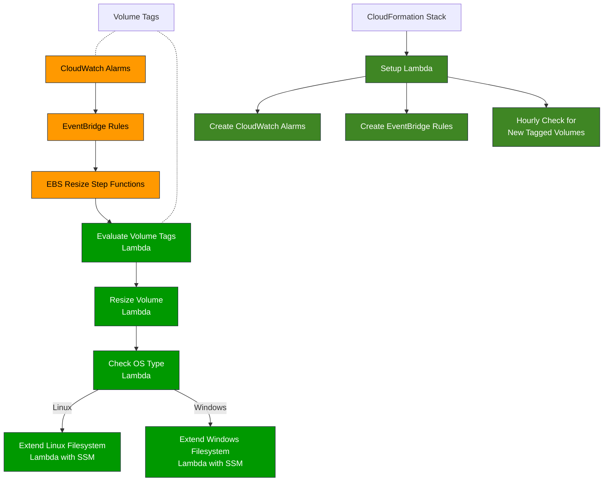
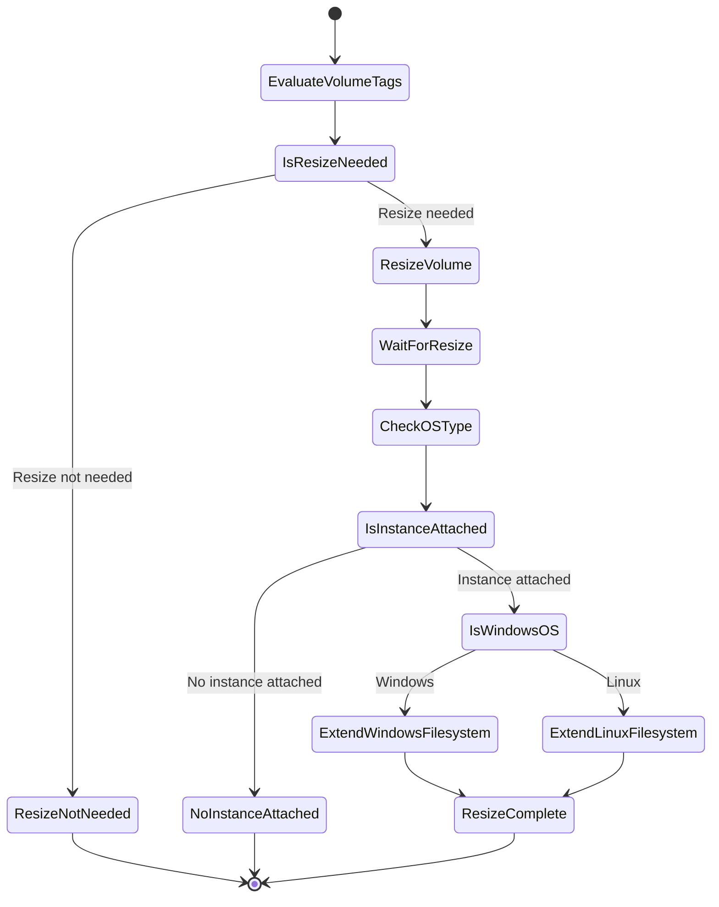

# EBS Auto-Resize Automation

This CloudFormation stack deploys an automated solution for monitoring and resizing EBS volumes based on usage thresholds. The system uses tag-based configuration to enable auto-resize on selected volumes and automatically extends both the volume and filesystem when usage exceeds configured thresholds.

## Table of Contents

- [Overview](#overview)
- [Architecture](#architecture)
- [Step Functions Workflow](#step-functions-workflow)
- [Tag-Based Configuration](#tag-based-configuration)
- [Installation](#installation)
- [Maintenance and Troubleshooting](#maintenance-and-troubleshooting)
- [Limitations and Considerations](#limitations-and-considerations)
- [Contributing](#contributing)

## Overview

The EBS Auto-Resize Automation provides the following capabilities:

- Monitors EBS volumes with `EBSAutoResize` tag set to "true"
- Triggers automatic resize when volume usage exceeds 90%
- Resizes volumes by configurable increments (defined in tags)
- Respects maximum size limits (defined in tags)
- Automatically extends the filesystem after resize
- Supports both Linux and Windows instances
- Maintains a resize history in volume tags

The solution uses CloudWatch alarms for monitoring, EventBridge rules for event routing, and Step Functions for orchestrating the resize workflow.

## Architecture

The solution consists of the following components:



### Key Components

1. **CloudFormation Stack**: Deploys the entire solution with all required components
2. **Alarm Creation Lambda**: Sets up monitoring for tagged volumes
3. **CloudWatch Alarms**: Monitor volume usage and trigger when 90% threshold is exceeded
4. **EventBridge Rules**: Route CloudWatch alarm events to the Step Functions state machine
5. **Step Functions State Machine**: Orchestrates the end-to-end resize workflow
6. **Lambda Functions**: Handle specific steps in the workflow:
   - Evaluate Volume Tags: Determines if and how to resize the volume
   - Resize Volume: Performs the actual EBS volume resize
   - Check OS Type: Identifies if volume is attached to Linux or Windows
   - Extend Linux/Windows Filesystem: Extends the filesystem on the respective OS

## Step Functions Workflow

The Step Functions state machine orchestrates the end-to-end resize process:



### Workflow Steps

1. **EvaluateVolumeTags**: Examines volume tags to determine if resize is needed
2. **IsResizeNeeded**: Decision point based on tag evaluation
3. **ResizeVolume**: Initiates the AWS EBS volume resize operation
4. **WaitForResize**: Waits for the resize operation to complete (30 seconds)
5. **CheckOSType**: Determines if volume is attached to Linux or Windows instance
6. **IsInstanceAttached**: Checks if volume is attached to an instance
7. **IsWindowsOS**: Determines OS type to execute proper filesystem extension
8. **ExtendLinuxFilesystem/ExtendWindowsFilesystem**: Extends the filesystem using SSM Run Command
9. **ResizeComplete**: Successfully completes the workflow

## Tag-Based Configuration

The automation uses the following tags on EBS volumes:

| Tag Name | Value Type | Description | Default |
|----------|------------|-------------|---------|
| `EBSAutoResize` | Boolean (string) | Enable/disable auto-resize | `false` |
| `ResizeAmountGB` | Integer (string) | Amount to resize by in GB | `10` |
| `MaxResizeGB` | Integer (string) | Maximum volume size in GB | `1000` |

Example:

```
EBSAutoResize = true
ResizeAmountGB = 20
MaxResizeGB = 500
```

With this configuration, the volume would resize in 20GB increments when usage exceeds 90%, but would not exceed 500GB total size.

## Installation

### Prerequisites

- AWS CLI configured with appropriate permissions
- Permission to create IAM roles
- Permission to deploy CloudFormation stacks

### Deployment Steps

1. Save the CloudFormation template to a file (e.g., `ebs-auto-resize.yaml`)
2. Deploy the stack:

```bash
aws cloudformation create-stack \
  --stack-name EBSAutoResize \
  --template-body file://ebs-auto-resize.yaml \
  --capabilities CAPABILITY_IAM
```

3. Wait for stack creation to complete:

```bash
aws cloudformation wait stack-create-complete --stack-name EBSAutoResize
```

### Enabling Auto-Resize on Volumes

To enable auto-resize on an EBS volume, add the following tags:

```bash
aws ec2 create-tags \
  --resources vol-12345abcdef \
  --tags \
    Key=EBSAutoResize,Value=true \
    Key=ResizeAmountGB,Value=20 \
    Key=MaxResizeGB,Value=500
```

## Maintenance and Troubleshooting

### Monitoring the Solution

You can monitor the solution using:

1. **CloudWatch Log Groups**:
   - `/aws/lambda/EvaluateVolumeTagsFunction`
   - `/aws/lambda/ResizeVolumeFunction`
   - `/aws/lambda/CheckOSTypeFunction`
   - `/aws/lambda/ExtendLinuxFilesystemFunction`
   - `/aws/lambda/ExtendWindowsFilesystemFunction`
   - `/aws/lambda/EBSAlarmCreationFunction`

2. **Step Functions Executions**:
   - Navigate to the Step Functions console
   - Select the `EBSResizeStateMachine`
   - View execution history and details

3. **CloudWatch Alarms**:
   - Check the status of `EBSVolumeUsageAlarm-*` alarms

### Common Issues and Resolutions

| Issue | Possible Cause | Resolution |
|-------|----------------|------------|
| Volume not resizing | Tags not applied correctly | Verify tags are spelled correctly with proper values |
| Volume not resizing | CloudWatch alarm not triggered | Check alarm configuration and threshold |
| Volume resized but filesystem not extended | SSM agent not running | Ensure SSM agent is installed and running |
| Filesystem extension failed | Missing permissions | Check IAM roles and SSM permissions |
| Windows filesystem not extending | Partition issue | Check Windows disk management logs |

### Alarm Not Triggering

If alarms aren't triggering when expected:

1. Verify the volume is publishing metrics:
   ```bash
   aws cloudwatch get-metric-statistics \
     --namespace AWS/EBS \
     --metric-name VolumeUsedSize \
     --dimensions Name=VolumeId,Value=vol-12345abcdef \
     --start-time $(date -d '1 hour ago' -u +%Y-%m-%dT%H:%M:%SZ) \
     --end-time $(date -u +%Y-%m-%dT%H:%M:%SZ) \
     --period 300 \
     --statistics Average
   ```

2. Check if the alarm exists:
   ```bash
   aws cloudwatch describe-alarms \
     --alarm-names EBSVolumeUsageAlarm-vol-12345abcdef
   ```

### Updating the Stack

To update the stack with changes:

```bash
aws cloudformation update-stack \
  --stack-name EBSAutoResize \
  --template-body file://ebs-auto-resize.yaml \
  --capabilities CAPABILITY_IAM
```

## Limitations and Considerations

- **Filesystem Types**: The automation supports ext2/3/4 and xfs on Linux, and NTFS on Windows
- **Attached Instances**: For filesystem extension to work, instances must:
  - Have the SSM agent installed and running
  - Have an instance profile allowing SSM operations
  - Be in a running state
- **Resize Timing**: There's a delay between volume resize and filesystem extension (30 seconds)
- **Cost Considerations**: This solution uses:
  - CloudWatch alarms (per alarm pricing)
  - Lambda invocations
  - Step Functions executions
  - SSM Run Command operations
- **Custom Partitions**: The automation may not work with complex disk partitioning schemes
- **Volume Types**: Works with all EBS volume types (gp2, gp3, io1, io2, st1, sc1)

### Security Considerations

- The solution uses IAM roles with least privilege permissions
- SSM operations execute on instances with user-defined permissions
- No sensitive data is stored in permanent storage

## Contributing

1. Fork the repository
2. Create a feature branch (`git checkout -b feature/my-feature`)
3. Commit your changes (`git commit -am 'Add my feature'`)
4. Push to the branch (`git push origin feature/my-feature`)
5. Create a new Pull Request